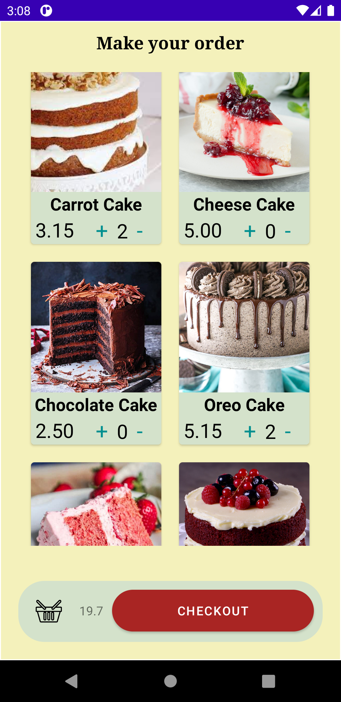

# CakeShopApp
Application that uses Room Library and MVVM architecture so the user can order cakes and check information about the orders

## Tools
|      Kotlin       |  Room   |                 MVVM                 |          Navigation Component
|:-------------:|:------:|:--------------------------------------:|:--------------------------------------:|
 | |  | 

## Information

With this application the user can order different types of cakes and also ckeck the information about the cakes and the orders. all the data is stored in a local database. 

## Functioning
### Welcome

When the application starts, a welcoming screen appears which shows three button with the different destinations.

 

### Order Fragment

If the user wants to make an order, a new fragment will appear showing a list with al the cakes availables and their price. The total price of the order will be updated using the viewmodel 

 

### Checkout Fragment

Once the user has finished the order, a fragment will appear showing all the information of the order so the user can check if everything is okay. if the order is correct, the user can finish the operation, and the order will be saved on the local database

 

 

### Order History Fragment

the user can see the order history by accessing the corresponding fragment from the main menu

 

### Cake Info Fragment

the user can also check for the cakes information to find out more about it

 

